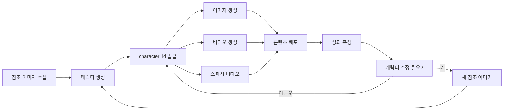

# character-mgmt

## 개요

AI 콘텐츠 제작에서 브랜드 일관성을 위한 캐릭터 관리 스킬입니다. Higgsfield AI의 캐릭터 시스템을 활용하여 참조 이미지(2~5장)와 설명만으로 브랜드 마스코트, 가상 인플루언서, 제품 스폰서서 등을 생성하고, 이미지 생성(Soul), 비디오 생성(DOP), 스피치 비디오 등 모든 Higgsfield 툴에서 재사용 가능한 `character_id`를 발급받습니다.

### 왜 캐릭터 관리가 필요한가요?

- **브랜드 일관성**: 마케팅 캠페인, 소셜 미디어, 광고에서 동일한 캐릭터 유지
- **시간 절약**: 매번 프롬프트에 캐릭터 설명을 반복할 필요 없음
- **품질 보장**: 참조 이미지 기반 학습으로 매번 비슷한 품질의 출력
- **스케일 가능성**: 하나의 캐릭터로 100+ 개의 콘텐츠 생성 가능

---

## 트리거 키워드

다음 요청 시 이 스킬을 사용하세요:

- **캐릭터 생성 관련**: "캐릭터 만들어줘", "브랜드 마스코트", "가상 인플루언서", "캐릭터 디자인", "AI 아바타"
- **캐릭터 재사용**: "이전에 만든 캐릭터 찾아줘", "character_id 조회", "캐릭터 아카이빙", "저장된 캐릭터"
- **캐릭터 수정/삭제**: "캐릭터 삭제", "마스코트 재생성", "캐릭터 목록"
- **브랜딩**: "브랜드 페이스", "제품 마스코트", "시리즈 캐릭터"

---

## 워크플로우

### 1. 캐릭터 생성

```
1. 참조 이미지 준비 (2~5장, 정면/측면/다양한 포즈)
2. 캐릭터 설명 작성
   - 이름: 예) "Luna the Tech Cat"
   - 외형: 예) "회색 고양이, 넥타이, 안경"
   - 성격: 예) "친근, 전문적, 유머러스"
   - 스타일: 예) "3D 렌더링, 픽사 스타일"
3. create_character 실행 → character_id 발급
4. 다른 스킬에서 character_id로 재사용
```

### 2. 캐릭터 검색

```
1. get_character에 character_id 전달
2. 캐릭터 상세 정보 반환 (이름, 설명, 생성일)
```

### 3. 캐릭터 삭제

```
1. delete_character에 character_id 전달
2. 영구 삭제 (복구 불가)
```

---

## 사용 예시

### 예시 1: 브랜드 마스코트 생성

```
"우리 스타트업 'TechNova'의 브랜드 마스코트를 만들어줘.
이름: Nova the Fox
외형: 주황색 여우, 하얀 가운, 고글 착용
성격: 호기심 많은 연구원
스타일: 3D 애니메이션, 귀여운 분위기
참조: fox_ref_1.png, fox_ref_2.png, fox_ref_3.png"
→ 출력: character_id = "characters/abc123"
```

### 예시 2: 가상 인플루언서 생성

```
"뷰티 유튜브 채널용 가상 인플루언서를 만들어줘.
이름: Sofia
외형: 20대 후반 한국인 여성, 긴 웨이브 헤어
스타일: K-뷰티, 세련된 메이크업
성격: 친근, 전문적, 트렌디
참조: sofia_front.jpg, sofia_side.jpg, sofia_smile.jpg"
→ 출력: character_id = "characters/def456"
```

### 예시 3: 생성된 캐릭터로 이미지 생성

```
(이전에 생성한 Nova the Fox 캐릭터 사용)
"Nova the Fox 캐릭터로 AI 도구 소개 이미지 5장 만들어줘.
1. 코드를 작성하는 Nova (노트북 앞)
2. 발표하는 Nova (프레젠테이션)
3. 커피를 마시는 Nova (휴식)
4. 팀원들과 협업하는 Nova (화상 회의)
5. 축하하는 Nova (성공)"
→ image-gen 스킬에서 character_id = "characters/abc123" 사용
```

### 예시 4: 캐릭터 검색 및 삭제

```
"저장한 캐릭터 목록 보여줘.
character_id가 'characters/old_mascot'인 캐릭터는 삭제해줘."
→ get_character로 조회 후 delete_character로 삭제
```

---

## 출력 형식

### 캐릭터 생성 출력

```json
{
  "character_id": "characters/abc123",
  "name": "Nova the Fox",
  "description": "주황색 여우 마스코트, TechNova 브랜드",
  "created_at": "2026-04-30T10:00:00Z",
  "status": "active"
}
```

### 캐릭터 검색 출력

```json
{
  "character_id": "characters/abc123",
  "name": "Nova the Fox",
  "description": "주황색 여우 마스코트, TechNova 브랜드",
  "reference_images": ["image_1.png", "image_2.png"],
  "created_at": "2026-04-30T10:00:00Z"
}
```

### 캐릭터 삭제 출력

```json
{
  "character_id": "characters/abc123",
  "status": "deleted",
  "deleted_at": "2026-04-30T12:00:00Z"
}
```

---

## 주의사항

### API 키 필수

**HIGGSFIELD_API_KEY** + **HIGGSFIELD_SECRET** 환경변수가 필요합니다.

1. [higgsfield.com](https://higgsfield.com) 가입 (현재 베타)
2. Settings → API Keys → Create Key Pair
3. `.env` 또는 시스템 환경변수에 등록:
   ```bash
   export HIGGSFIELD_API_KEY="your_api_key"
   export HIGGSFIELD_SECRET="your_secret_key"
   ```

### 참조 이미지 가이드

좋은 참조 이미지의 조건:
- **최소 2장, 최대 5장**: 다양한 각도와 표정
- **정면 이미지 필수**: 얼굴 특징을 명확히 파악
- **높은 해상도**: 최소 512x512 픽셀
- **일관된 스타일**: 모든 참조 이미지가 비슷한 화법/조명
- **단순한 배경**: 캐릭터가 명확히 구분되도록

나쁜 참조 이미지의 예:
- 흐릿하거나 노이즈가 많은 이미지
- 극단적으로 다른 스타일 (예: 사진 1장 + 만화 1장)
- 얼굴이 가려진 이미지만 있는 경우
- 과도하게 필터가 적용된 이미지

### 캐릭터 일관성 범위

생성된 캐릭터는 **Higgsfield 툴 내에서만** 일관성이 보장됩니다:

- ✅ **지원**: image-gen (Soul), video-gen (DOP), speech-video
- ❌ **미지원**: fal-gateway, 다른 플러그인의 스킬

Higgsfield 외부에서 캐릭터를 사용하려면:
1. Higgsfield에서 캐릭터가 포함된 이미지를 먼저 생성
2. 해당 이미지를 다른 툴의 참조 이미지로 사용 (IP Adapter 등)

### 요금 및 제한

- **베타 기간**: 무료 (정책 변경 가능)
- **캐릭터 저장 수**: 제한 없음 (베타 기간)
- **삭제 주의**: 삭제된 캐릭터는 복구 불가

### 캐릭터 ID 관리 팁

- **명명 규칙**: `characters/{brand}_{name}` 형식 권장
  - 예: `characters/technova_nova`, `characters/sofia_beauty`
- **문서화**: 프로젝트 문서에 character_id과 용도 기록
- **버전 관리**: 캐릭터 수정 시 새 ID 생성 (덮어쓰기 불가)

---

## 관련 스킬

### 캐릭터 소비 스킬

- **image-gen**: 캐릭터가 포함된 이미지 생성 (Soul 모델)
- **video-gen**: 캐릭터가 등장하는 비디오 생성 (DOP 모델)
- **speech-video**: 캐릭터가 말하는 비디오 생성 (립싱크)

### 보완 스킬

- **gil-content:copywriting**: 캐릭터 성격, 대사, 스토리라인 정의
- **gil-domain-brand-design**: 브랜드 가이드라인에 맞는 캐릭터 스타일 정의

---

## MCP 서버 설정

이 스킬은 **Higgsfield MCP** (stdio)를 사용합니다.

```json
{
  "higgsfield": {
    "command": "uvx",
    "args": ["higgsfield-mcp"],
    "env": {
      "HIGGSFIELD_API_KEY": "${HIGGSFIELD_API_KEY}",
      "HIGGSFIELD_SECRET": "${HIGGSFIELD_SECRET}"
    }
  }
}
```

MCP 서버 등록 절차: `gil-media/CONNECTORS.md` 참조.

---

## 캐릭터 라이프사이클



**핵심**: 한 번 생성된 캐릭터는 수많은 콘텐츠로 파생됩니다. 초기 참조 이미지 투자가 중요합니다.